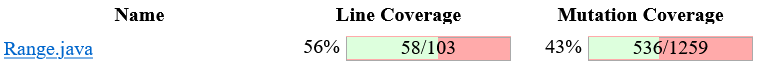
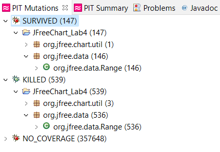
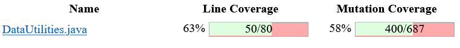
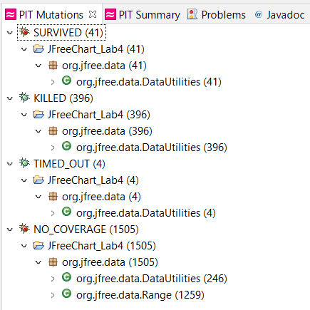
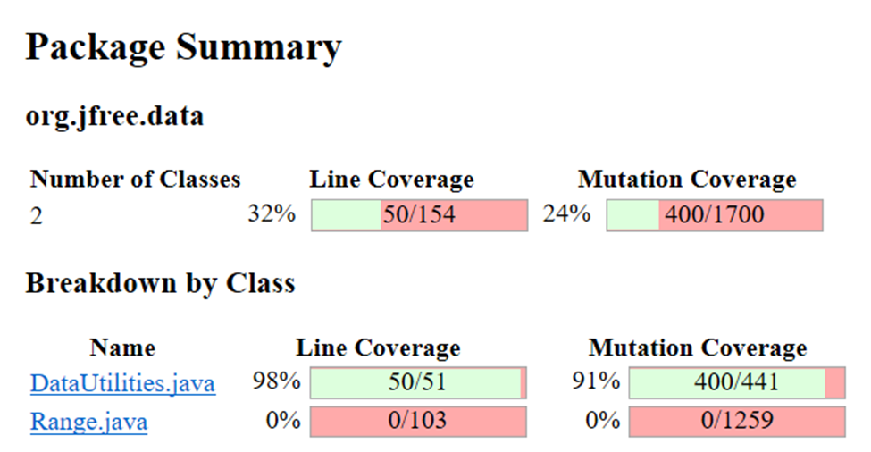
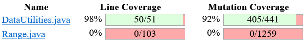

# SENG-637 Assignment 4

**Topic** - Mutation Testing and Web app testing

## Table of Contents

- [Introduction](#introduction)
- [Video demo](#video-demo)
- [Analysis of 10 mutants of the Range class](#analysis-of-10-mutants-of-the-range-class)
- [Mutation score and statistics](#mutation-score-and-statistics)
- [Analysis drawn on the effectiveness of each of the test classes](#analysis-drawn-on-the-effectiveness-of-each-of-the-test-classes)
- [A discussion on the effect of equivalent mutants on mutation score accuracy](#a-discussion-on-the-effect-of-equivalent-mutants-on-mutation-score-accuracy)
- [A discussion of what could have been done to improve the mutation score of the test suites](#a-discussion-of-what-could-have-been-done-to-improve-the-mutation-score-of-the-test-suites)
- [Need for mutation testing](#need-for-mutation-testing)
- [Explain your SELENUIM test case design process](#explain-your-selenium-test-case-design-process)
- [Explain the use of assertions and checkpoints](#explain-the-use-of-assertions-and-checkpoints)
- [Testing functionalities with different test data](#testing-functionalities-with-different-test-data)
- [Selenium vs Sikulix](#selenium-vs-sikulix)
- [Division of team work](#division-of-team-work)
- [Difficulties, challenges, and lessons learned](#difficulties-challenges-and-lessons-learned)
- [Comments and feedback](#comments-and-feedback)
- [Contributors](#contributors)

## Introduction

## Video demo

Link to the video demonstration of killed/surviving mutants and is _TBA_.

## Analysis of 10 mutants of the Range class

### Mutation #1:
Within the intersect method of the Range class, one of the mutations done is:
“Incremented (a++) double local variable number 3 → SURVIVED”
Upon analysis of the PIT report, this is applied to the line:
“return (b0 < this.upper && b1 >= b0);”
This is an equivalent mutation and cannot be killed as it is post increment on a return statement, which means that the increment will not be used again.

### Mutation #2:
Within the intersect method of the Range class, one of the mutations done is:
“Decremented (a--) double local variable number 3 → SURVIVED”
Upon analysis of the PIT report, this is applied to the line:
“return (b0 < this.upper && b1 >= b0);”
This is an equivalent mutation and cannot be killed as it is post derement on a return statement, which means that the decrement will not be used again.


## Mutation score and statistics

After commenting out failing test cases in Assignment 3, we ran mutation tests on `Range` and `DataUtilities`.

- **Mutation score of Range - before**

  

- **Mutation statistics of Range - before**

  

  | Method                                   | Survived | Killed | Total | Coverage % |
  | ---------------------------------------- | -------- | ------ | ----- | ---------- |
  | `Range.isNaNRange()`                     | 10       | 33     | 43    | 76.74      |
  | `Range.shift(Range, double, boolean)`    | 9        | 53     | 62    | 85.48      |
  | `Range.intersects(double, double)`       | 23       | 83     | 106   | 78.30      |
  | `Range.expandToInclude(Range, double)`   | 10       | 57     | 67    | 85.07      |
  | `Range.combineIgnoringNaN(Range, Range)` | 18       | 68     | 86    | 79.07      |

- **Mutation score of DataUtilities - before**

  

- **Mutation statistics of DataUtilities - before**

  

  | Method                                                     | Survived | Killed | Total | Coverage % |
  | ---------------------------------------------------------- | -------- | ------ | ----- | ---------- |
  | `DataUtilities.calculateRowTotal(Values2D, int)`           | 6        | 61     | 67    | 91.04      |
  | `DataUtilities.calculateRowTotal(Values2D, int, int[])`    | 11       | 80     | 91    | 87.91      |
  | `DataUtilities.calculateColumnTotal(Values2D, int)`        | 6        | 61     | 67    | 91.04      |
  | `DataUtilities.calculateColumnTotal(Values2D, int, int[])` | 11       | 80     | 91    | 87.91      |
  | `DataUtilities.getCumulativePercentages(KeyedValues)`      | 7        | 118    | 125   | 94.40      |

After adding more test cases, we again ran mutation tests on `Range` and `DataUtilities`.

- **Mutation score of Range - after**

  

- **Mutation statistics of Range - after**

  

  | Method                                   | Survived | Killed | Total | Coverage % |
  | ---------------------------------------- | -------- | ------ | ----- | ---------- |
  | `Range.isNaNRange()`                     |          |        |       |            |
  | `Range.shift(Range, double, boolean)`    |          |        |       |            |
  | `Range.intersects(double, double)`       |   21     |   85   |  106  |   80.2     |
  | `Range.expandToInclude(Range, double)`   |          |        |       |            |
  | `Range.combineIgnoringNaN(Range, Range)` |          |        |       |            |

- **Mutation score of DataUtilities - after**

  

- **Mutation statistics of DataUtilities - after**

  

  | Method                                                     | Survived | Killed | Total | Coverage % |
  | ---------------------------------------------------------- | -------- | ------ | ----- | ---------- |
  | `DataUtilities.calculateRowTotal(Values2D, int)`           | 5        | 62     | 67    | 92.54      |
  | `DataUtilities.calculateRowTotal(Values2D, int, int[])`    | 10       | 81     | 91    | 89.01      |
  | `DataUtilities.calculateColumnTotal(Values2D, int)`        | 5        | 62     | 67    | 92.54      |
  | `DataUtilities.calculateColumnTotal(Values2D, int, int[])` | 10       | 81     | 91    | 89.01      |
  | `DataUtilities.getCumulativePercentages(KeyedValues)`      | 6        | 119    | 125   | 95.20      |

## Analysis drawn on the effectiveness of each of the test classes
### Test Case: intersectsWithReverse
Within the intersect method of the Range class, one of the mutations survived is:
“removed conditional - replaced comparison check with true’”
If we look closely at the intersect method source code, one of the line states:
“return (b0 < this.upper && b1 >= b0);”
One of the condition it checks is b1>=b0. The mutation mutates the b1>=b0 such that it is always true. 
Given that, if a test case is created such that b1>=b0 equals false, or b0>b1, then it should effectively kill the mutation.
In the intersectsWithReverse test case, we call the intersect method for the range of -10 to 10 with b0 = -6 and b1 = -9. In this case, b0>b1, and as a result, it effectively killed the mutation.


## A discussion on the effect of equivalent mutants on mutation score accuracy

By definition, equivalent mutants are the mutants that cannot be killed under any test cases as no test case can distinguish equivalent mutants from the original program.

Since these mutants cannot be killed yet still counts as part of the mutation coverage, it will always contribute in the lowering the test cases mutation score accuracy.

One of the equivalent mutant examples that we have come across are the post increment and decrement mutants that were injected into all of the methods where we have tried many ways to eliminate these mutants, yet we can never kill it.


Although equivalent mutations are hard to detect and they impede on the reliance of these results, there have been theoretically ways that can detect these mutations. Upon researching on this topic, there has been several methods proposed in different research in detecting equivalent mutations such as:
-	Detecting whether the mutation actually change the coverage (reference: https://onlinelibrary.wiley.com/doi/10.1002/stvr.1473)
-	trace inclusion check or constraint resolving (reference: https://www.conformiq.com/2019/07/mutation-testing/)


## A discussion of what could have been done to improve the mutation score of the test suites

For this assignment, the objective is to create test cases that help improve the mutation score of the 5 methods that we focused on for the Range and DataUtilities class. However, the scores includes mutations that are of other methods within the class.

As such, one way to improve the accuracy scores is to added additional test cases for the methods from the class source code that are not originally tested by our test cases. 

## Need for Mutation Testing

**Need**

Mutation testing is required to test the effectiveness of the test suite. It process by which we can determine if the test suite is detecting injected bugs.

- **Advantages**[[1]](https://www.softwaretestingclass.com/mutation-testing-advantages-and-disadvantages/)

  - Mutation testing has the ability to detect all faults in the source code
  - High coverage of the source program is attained
  - Program mutants are tested thoroughly
  - Quality of software program is improved
  - Loopholes in test data can be identified

- **Disadvantages**[[1]](https://www.softwaretestingclass.com/mutation-testing-advantages-and-disadvantages/)

  - Complex mutations are difficult to implement
  - Mutation testing is time-consuming and expensive
  - Mutation testing is not applicable for black-box testing as involves a lot of source code changes
  - Automation is necessary for mutation testing as it is very time-consuming

## Explain your SELENUIM test case design process

With our Selenium test case design, we first define the test scenario as a group in the perspective of the user who is visiting indigo.ca.

With this in mind, we have envision our user to conduct the following actions on the website:

- Login
- Search for a store
- Changing email communication preferences
- Add and remove items from cart
- Add and remove items from wishlist
- Changing account details
- Sorting the items within categories
- Filtering the items within categories

After defining the list of actions that a user will conduct in our test scenario, we then progress to creating test cases for these actions to verify the functionality works according to expectations.

For example with login, we would define test cases to ensure the function works appropriately when right credentials were entered as well as when the wrong credentials were entered.

## Explain the use of assertions and checkpoints

Assertions and checkpoints are used to verify at specific points of the test cases that the functionality is working as intended.

For example, for the test cases with the Indigo's cart, we asserted the number of items in the cart shown on the site with the number of items that we actually added. Likewise, we assert the label "Empty Cart" when we have removed all of the items to ensure that the cart is working as expected.

## Testing functionalities with different test data

Each of the eight functionalities chosen was tested with different test data using Selenium IDe. The table below summarizes functionalities and items that were tested.

| Functionality            | Test                                                     |
| ------------------------ | -------------------------------------------------------- |
| Login                    | Test login with invalid password                         |
|                          | Test login with valid password                           |
| Email preferences        | Test opt-out of all email communication                  |
|                          | Test opt-in of all email communication                   |
| Finding different stores | _TBA_                                                    |
|                          | _TBA_                                                    |
| Changing account details | Test changing phone number with valid number             |
|                          | Test changing phone number with invalid number (letters) |
| Finding different stores | Search by city name                                      |
|                          | Search by postal code                                    |
| Cart                     | Test adding items to the cart                            |
|                          | Test removing items from the cart                        |
| Wishlist                 | Test adding items to the wishlist                        |
|                          | Test removing items from the wishlist                    |
| Filtering search results | _TBA_                                                    |
|                          | _TBA_                                                    |
| _TBA_                    | _TBA_                                                    |
|                          | _TBA_                                                    |

## Selenium vs Sikulix

**Advantages of Sikulix**

1. Sikulix uses image recognition powered by OpenCV to identify GUI components. This is handy when there is no easy access to a GUI's internals or the source code.

**Disadvantages of Sikulix**

1. Less popular than Selenium, and thus difficult to find support.

2. Requires 64-bit Java 8 or above to work

**Advantages of Selenium**

1. More popular than Sikulix, and thus easy to find support.

2. Selenium IDE can be added as an extension/addon on most of the modern browsers. It doesn't has any special requirements.

**Disadvantages of Selenium**

1. Image recognition to identify GUI components is not possible.

## Division of team work

**Division of Selenium IDE test cases**

| Tester                   | Functionality            |
| ------------------------ | ------------------------ |
| Bhavyai Gupta            | Login                    |
| Bhavyai Gupta            | Email preferences        |
| Drew Burritt             | Finding different stores |
| Drew Burritt             | Changing account details |
| Michael Man Yin Lee      | Cart                     |
| Michael Man Yin Lee      | Wishlist                 |
| Okeoghenemarho Obuareghe | Filtering search results |
| Okeoghenemarho Obuareghe | _TBA_                    |

## Difficulties, challenges, and lessons learned

1. There was some issues while setting up of Pitest in Eclipse. During the installaion of Pitest from the Eclipse marketplace, one of the group member was getting errors like below.

   ```
   An error occurred while collecting items to be installed
     session context was:(profile=C__Program Files_Eclipse_eclipse,
     phase=org.eclipse.equinox.internal.p2.engine.phases.Collect,
     operand=, action=).

     No repository found containing:
     osgi.bundle,com.google.guava,21.0.0.v20170206-1425
   ```

   Later it was found that the problem is arising with newer version of the Eclipse. After downgrading Eclipse from **2021-12** to **2021-03**, Pitest was installed successfully.

2. Some websites add an another authentication factor like **CAPTCHA** when they detect automated interactions with their websites. So, selenium test cases that includes login pause in the middle until the tester manually deals with those CAPTCHAs.

3. To objective for improving mutation scores to at least 10% for each class is very difficult to obtain because we are focusing on the 5 methods of each class from the previous assignments. Our test cases only yields a mutation coverage of 58% because they are designed to only cover the 5 methods from the class. If we were to delete all of the other methods besides the 5 methods that we wrote test cases for from our previous assignments, our tests yields 91% mutation coverage.



We have also written 5 test cases for the data utilities class and with those 5 test cases, we have increase the mutations killed from 400 to 405 out of 441, which means we increased it by 1%.



## Comments and feedback

1. This assignment gave us a chance to further improve our test suite using mutation testing.

2. The assignment description document [`Assignment4.md`](Assignment4.md) is very detailed and comprehensive, and it was easy to follow.

## Contributors

We are group 5, and below are the team members

- [Bhavyai Gupta](https://github.com/zbhavyai)
- [Drew Burritt](https://github.com/dburritt)
- [Michael Man Yin Lee](https://github.com/mlee2021)
- [Okeoghenemarho Obuareghe](https://github.com/oobuareghe)
