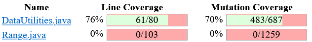

# SENG-637 Assignment 4

**Topic** - Mutation Testing and Web app testing

## Table of Contents

- [Introduction](#introduction)
- [Video demo](#video-demo)
- [Analysis of 10 mutants of the Range class](#analysis-of-10-mutants-of-the-range-class)
- [Mutation score and statistics](#mutation-score-and-statistics)
- [Analysis on effectiveness of each of the test classes](#analysis-on-effectiveness-of-each-of-the-test-classes)
- [Effect of equivalent mutants on mutation score accuracy](#effect-of-equivalent-mutants-on-mutation-score-accuracy)
- [What could have been done to improve the mutation score of the test suites](#what-could-have-been-done-to-improve-the-mutation-score-of-the-test-suites)
- [Need for mutation testing](#need-for-mutation-testing)
- [Selenium IDE test case design process](#selenium-ide-test-case-design-process)
- [Use of assertions and checkpoints](#use-of-assertions-and-checkpoints)
- [Testing functionalities with different test data](#testing-functionalities-with-different-test-data)
- [Selenium vs Sikulix](#selenium-vs-sikulix)
- [Division of team work](#division-of-team-work)
- [Difficulties, challenges, and lessons learned](#difficulties-challenges-and-lessons-learned)
- [Comments and feedback](#comments-and-feedback)
- [Contributors](#contributors)

## Introduction

In this assignment, we will explore mutation testing with the help of Pitest eclipse plugin to see how good our test suite is in catching bugs. Then, we will try to improve our test suite by adding more test cases which would increase our mutation score by atleast 10%.

Then, in the next part of this assignment, we will use Selenium IDE to test few different functionalities of the [Indigo](https://www.chapters.indigo.ca/en-ca/) website.

## Video demo

Link to the video demonstration of killed/surviving mutants and is _TBA_.

## Analysis of 10 mutants of the Range class

1. #### Mutation #1 (on line #161, mutation #40)

   Mutation applied by Pitest was `Incremented (a++) double local variable number 3 → SURVIVED` on the method `expandToIncludeintersects(double, double)`. This mutation was applied to the below line of code

   ```
   return (b0 < this.upper && b1 >= b0);
   ```

   This mutation tries to update the value of b1 by 1 using post-increment operator. Since b1 is used only once in the statement, this mutation has no effect on the outcome of the test case. Hence it behaves like an equivalent mutation, which cannot be killed.

2. #### Mutation #2 (on line #161, mutation #44)

   Mutation applied by Pitest was `Decremented (a--) double local variable number 3 → SURVIVED` on the method `expandToIncludeintersects(double, double)`. This mutation was applied to the below line of code

   ```
   return (b0 < this.upper && b1 >= b0);
   ```

   This mutation tries to update the value of b1 by 1 using post-decrement operator. Since b1 is used only once in the statement, this mutation has no effect on the outcome of the test case. Hence it behaves like an equivalent mutation, which cannot be killed.

3. #### Mutation #3 (on line #305, mutation #1)

   Mutation applied by Pitest was `changed conditional boundary → SURVIVED` on the method `expandToInclude(Range, double)`. This mutation was applied to the below line of code

   ```
   if (value < range.getLowerBound()) {
   ```

   According to the official Pitest documentation, this mutation changes the condition `value < range.getLowerBound()` to `value <= range.getLowerBound()`. Examining the original function we can see this results in an equivalent mutation. For example, with range (-10, 10) and value of -10 the final else statement would be executed and the original range is returned. The mutation of `<` to `<=` results in the line `return new Range(value, range.getUpperBound());` being executed instead. However the new range would still be (-10, 10), which is same result as returning the original range. Therefore this is an equivalent mutation and can not be killed.

4. #### Mutation #4 (on line #305, mutation #4)

   Mutation applied by Pitest was `removed conditional - replaced comparison check with false → KILLED` on the method `expandToInclude(Range, double)`. This mutation was applied to the below line of code

   ```
   if (value < range.getLowerBound()) {
   ```

   This mutation replaces the conditional with `false`. `expandToIncludeWithInputBLB` is one of the many test cases that kills this mutation. This method uses a range of (-10, 10) and value of -10.00001. Using these numbers, when the conditional in the if statement is replaced with `false`, the else statement will be executed instead. This returns the orignal range and does not expand it as intended. As the returned range does not match the expected range, the test fails and this mutation is killed.

5. #### Mutation #5 (on line #161, mutation #3)

   Mutation applied by Pitest was `changed conditional boundary → KILLED` on the method `intersects(double, double)`. This mutation was applied to the below line of code

   ```
   return (b0 < this.upper && b1 >= b0);
   ```

   According to the official Pitest documentation, this mutation changes the condition `b0 < this.upper` to `b0 <= this.upper`. One of our test case `intersectsWithInputUBAndAUB` tests this boundary, by supplying `b0` equal to `this.upper`. With original code, the test case passes as the method returns `false`. However, the mutation causes the method to return `true` and the test case fails. Hence this mutation was killed.

6. #### Mutation #6 (on line #365, mutation #1)

   Mutation applied by Pitest was `removed call to org/jfree/chart/util/ParamChecks::nullNotPermitted → SURVIVED` on the method `shift(Range, double, boolean)`. This mutation was applied to the below line of code

   ```
   ParamChecks.nullNotPermitted(base, "base");
   ```

   This mutation removes the call to the above line. The method call throws `IllegalArgumentException` if the parameter base is null. Since there was no test case that tests base as null for this method, the removal of the call to `ParamChecks.nullNotPermitted()` did not make any difference to any of the test cases. Hence the mutation was survived.

7. #### Mutation #7 (on line #448, mutation #1)

   Mutation applied by Pitest was `replaced boolean return with false for org/jfree/data/Range::isNaNRange → KILLED` on the method `isNaNRange()`. This mutation was applied to the below line of code

   ```
   return Double.isNaN(this.lower) && Double.isNaN(this.upper);
   ```

   This mutation replaces the whole boolean statement with `false`. This change propagates to the output of the method, as all the test cases will fail even if both the lower and upper bounds are not equal to `Double.NaN`. This will make several of our test cases fail. Couple of the test cases that kills this mutation are `isNaNRangeWithBothBoundNOM` and `isNaNRangeWithUpperBoundNaN`. Hence this mutation was killed.

8. #### Mutation #8 (on line #448, mutation #15)

   Mutation applied by Pitest was `Negated double field lower → SURVIVED` on the method `isNaNRange()`. This mutation was applied to the below line of code

   ```
   return Double.isNaN(this.lower) && Double.isNaN(this.upper);
   ```

   This mutation negates the `this.lower` before feeding to `Double.isNaN`. Since `Double.isNaN` return true only for NaN, this mutation will not have any impact on the output of the method. For example, if `this.lower` is equal to 30, then `Double.isNaN` will return `false` both 30 and -30. So this mutation will not be killed any test cases.

9. #### Mutation #9 (on line #241, mutation #1)

   Mutation applied by Pitest was `negated conditional → KILLED` on the method `combineIgnoringNaN(Range, Range)`. This mutation was applied to the below line of code

   ```
   if (range1 == null) {
   ```

   This mutation negates the conditional. When this condition is negated, all the non null range1 will pass this condition. This would propagate to the output. For example, in the test `combineIgnoringNaNWithDisjointRange`, range1 and range2 are neither null nor NaN. So, the mutated method will result in range2 being returned. This will make the test case fail, as a combined range should have been returned. Hence this mutation was killed.

10. #### Mutation #10 (on line #248, mutation #3)

    Mutation applied by Pitest was `removed conditional - replaced equality check with false → KILLED` on the method `combineIgnoringNaN(Range, Range)`. This mutation was applied to the below line of code

    ```
    if (range1.isNaNRange()) {
    ```

    This mutation replaces the conditional with `false`. The execution is reached here when input range1 is not null and range2 is null. If the range1 is a NaN range, then null should have been returned by the method. However, because of the mutation, range1 is returned. Our test case `combineIgnoringNaNWithFirstRangeNaNSecondRangeNull` will fail because of this mutation. Hence this mutation was killed.

## Mutation score and statistics

After commenting out failing test cases in Assignment 3, we ran mutation tests on `Range` and `DataUtilities`. **Note**: All the 4 tables below includes equivalent mutations in coverage calculations in order to be consistent with the Pitest scores.

- **Mutation score of Range - before**

  

- **Mutation statistics of Range - before**

  

  Due to the the Range class containing other methods that are not tested, the overall score is not a very accurate measure of the coverage. Below is the coverage of each method calculated manually.

  | Method                                   | Survived | Killed | Total | Coverage % |
  | ---------------------------------------- | -------- | ------ | ----- | ---------- |
  | `Range.isNaNRange()`                     | 10       | 33     | 43    | 76.74      |
  | `Range.shift(Range, double, boolean)`    | 9        | 53     | 62    | 85.48      |
  | `Range.intersects(double, double)`       | 23       | 83     | 106   | 78.30      |
  | `Range.expandToInclude(Range, double)`   | 10       | 57     | 67    | 85.07      |
  | `Range.combineIgnoringNaN(Range, Range)` | 18       | 68     | 86    | 79.07      |
  | Total                                    | 70       | 294    | 364   | 80.77      |

- **Mutation score of Range - after**

  

- **Mutation statistics of Range - after**

  

  Below is the coverage of each method calculated manually for the Range class after adding test cases. As we could not improve scores significantly test cases for two additional methods were also created.

  | Method                                   | Survived | Killed | Total | Coverage % |
  | ---------------------------------------- | -------- | ------ | ----- | ---------- |
  | `Range.isNaNRange()`                     | 10       | 33     | 43    | 76.74      |
  | `Range.shift(Range, double, boolean)`    | 8        | 54     | 62    | 87.10      |
  | `Range.intersects(double, double)`       | 17       | 89     | 106   | 83.96      |
  | `Range.expandToInclude(Range, double)`   | 10       | 57     | 67    | 85.07      |
  | `Range.combineIgnoringNaN(Range, Range)` | 10       | 76     | 86    | 88.72      |
  | Total for original methods               | 55       | 309    | 364   | 84.89      |
  | -                                        | -        | -      | -     | -          |
  | `Range.combine(Range, Range)`            | 4        | 29     | 33    | 87.87      |
  | `Range.expand(Range, Range)`             | 16       | 118    | 134   | 88.60      |
  | Total including new methods              | 75       | 456    | 531   | 85.87      |

- **Mutation score of DataUtilities - before**

  

- **Mutation statistics of DataUtilities - before**

  

  Due to the the DataUtilities class containing other methods that are not tested, the overall score is not a very accurate measure of the coverage. Below is the coverage of each method calculated manually.

  | Method                                                     | Survived | Killed | Total | Coverage % |
  | ---------------------------------------------------------- | -------- | ------ | ----- | ---------- |
  | `DataUtilities.calculateRowTotal(Values2D, int)`           | 6        | 61     | 67    | 91.04      |
  | `DataUtilities.calculateRowTotal(Values2D, int, int[])`    | 11       | 80     | 91    | 87.91      |
  | `DataUtilities.calculateColumnTotal(Values2D, int)`        | 6        | 61     | 67    | 91.04      |
  | `DataUtilities.calculateColumnTotal(Values2D, int, int[])` | 11       | 80     | 91    | 87.91      |
  | `DataUtilities.getCumulativePercentages(KeyedValues)`      | 7        | 118    | 125   | 94.40      |
  | Total                                                      | 41       | 400    | 441   | 90.70      |

  After adding more test cases, we again ran mutation tests on `Range` and `DataUtilities`.

- **Mutation score of DataUtilities - after**

  

- **Mutation statistics of DataUtilities - after**

  

  | Method                                                     | Survived | Killed | Total | Coverage % |
  | ---------------------------------------------------------- | -------- | ------ | ----- | ---------- |
  | `DataUtilities.calculateRowTotal(Values2D, int)`           | 5        | 62     | 67    | 92.54      |
  | `DataUtilities.calculateRowTotal(Values2D, int, int[])`    | 10       | 81     | 91    | 89.01      |
  | `DataUtilities.calculateColumnTotal(Values2D, int)`        | 5        | 62     | 67    | 92.54      |
  | `DataUtilities.calculateColumnTotal(Values2D, int, int[])` | 10       | 81     | 91    | 89.01      |
  | `DataUtilities.getCumulativePercentages(KeyedValues)`      | 6        | 119    | 125   | 95.20      |
  | Total for original methods                                 | 36       | 405    | 441   | 91.83      |
  | -                                                          | -        | -      | -     | -          |
  | `DataUtilities.createNumberArray(double[])`                | 3        | 35     | 38    | 92.10      |
  | `DataUtilities.createNumberArray2D(double[][])`            | 1        | 43     | 44    | 97.72      |
  | Total including new methods                                | 40       | 483    | 523   | 92.35      |

## Analysis on effectiveness of each of the test classes

As per our analysis, the test suite developed by us in previous assignments was good enough to check most of the boundary conditions and it had high coverage for each of the method tested.

When we analyzed the Pitest reports for both the `Range` class and `DataUtilities` class, we found that most of the surviving mutants were because of equivalent mutations. Therefore, very little could have been done to improve upon the mutation scores. The only method that had a significant number of non-equivalent mutations was `Range.combineIgnoringNaN(Range, Range)` where an additional 8 mutants could be killed, increasing the coverage for this method by 9.65%.

## Effect of equivalent mutants on mutation score accuracy

By definition, equivalent mutants are the mutants are syntactically different but semantically equivalent to the original program. So, equivalent mutations are not simulating bugs in the SUT. So, they cannot be killed by test cases.

Since these mutants cannot be killed yet still counts as part of the mutation coverage, it will always contribute in the lowering the test cases mutation score accuracy.

One of the equivalent mutant examples that we have come across are the post-increment and post-decrement mutants that were injected into all of the methods. We had tried many ways to eliminate these mutants, yet we can not kill most of them. This is because these equivalent mutations were injected in the return statement of the methods, where changing the value of the variable after its use will not have any effect on the return value.

Although equivalent mutations are hard to detect and they impede on the reliance of these results, there have been theoretically ways that can detect these mutations. Upon researching on this topic, there has been several methods proposed in different research in detecting equivalent mutations such as:

- Detecting whether the mutation actually change the coverage (reference: https://onlinelibrary.wiley.com/doi/10.1002/stvr.1473)
- trace inclusion check or constraint resolving (reference: https://www.conformiq.com/2019/07/mutation-testing/)

## What could have been done to improve the mutation score of the test suites

For this assignment, the objective is to create test cases that help improve the mutation score of the 5 methods that we focused on for the `Range` and `DataUtilities` class. However, the scores includes mutations that are of other methods within the class.

As such, one way to improve the accuracy scores is to add additional test cases for the methods that were not originally covered by our test cases. As discussed above, our original test suite killed almost every non-equivalent mutation so there was little room for improvement. After adding test cases to kill reamining mutants, we decided to add tests for two more methods in the `Range` class and in the `DataUtilities` class to increase the overall mutation coverage score. These were for `Range.combine(Range, Range)`, `Range.expand(Range, double, double)`, `DataUtilities.createNumberArray(double[])`, and `DataUtilities.createNumberArray2D(double[][])`. Covering more methods in the class significantly increased the overall coverage.

## Need for Mutation Testing

Mutation testing is required to test the effectiveness of the test suite. It process by which we can determine if the test suite is detecting injected bugs.

- **Advantages**[[1]](https://www.softwaretestingclass.com/mutation-testing-advantages-and-disadvantages/)

  - Mutation testing has the ability to detect all faults in the source code
  - High coverage of the source program is attained
  - Program mutants are tested thoroughly
  - Quality of software program is improved
  - Loopholes in test data can be identified

- **Disadvantages**[[1]](https://www.softwaretestingclass.com/mutation-testing-advantages-and-disadvantages/)

  - Complex mutations are difficult to implement
  - Mutation testing is time-consuming and expensive
  - Mutation testing is not applicable for black-box testing as involves a lot of source code changes
  - Automation is necessary for mutation testing as it is very time-consuming

## Selenium IDE test case design process

First, we decided which website should be tested using the Selenium IDE. We explored CanadianTire and Indigo, and found that CanadianTire requires entering one-time code during login to the website. So, to prevent manual inputs we decided not to test this and rather go with Indigo.

After choosing Indigo as our SUT, we decided what all functionalities should be part of the test cases. We decided to test those functionalities that might be used most often by the user (excluding purchases). With this in mind, we had envisioned our user to conduct the following actions on the website -

- Login
- Search for a store
- Changing email communication preferences
- Add and remove items from cart
- Add and remove items from wishlist
- Changing account details
- Sorting the items within categories
- Filtering the items within categories

After defining the list of actions that a user will conduct in our test scenario, we then progress to creating test cases for these actions to verify the functionality works according to the expectations.

For example, with login, we would define test cases to ensure the function works appropriately when right credentials were entered as well as when the wrong credentials were entered.

## Use of assertions and checkpoints

Assertions and checkpoints are used to verify at specific points of the test cases that the functionality is working as intended.

For example, for the test cases with the Indigo's cart, we asserted the number of items in the cart shown on the site with the number of items that we actually added. Likewise, we assert the label "Empty Cart" when we have removed all of the items to ensure that the cart is working as expected.

In the Selenium IDE, these functionalities are implemented using `assert` and `verify` commands (and their derivatives). According the [official Selenium IDE documentation](https://www.selenium.dev/selenium-ide/docs/en/api/commands), the test case stops if the `assert` fails, but continues even if `verify` fails.

| Test script name                     | Example of automated verification checkpoint |
| ------------------------------------ | -------------------------------------------- |
| AddBooks_EmptyCart                   |                                              |
| ChangeAccount_correct_phonenumber    |                                              |
| ChangeAccount_incorrect_phonenumber  |                                              |
| EmailPreferences_opt_in              | Verfies preference change message            |
| EmailPreferences_opt_out             | Verfies preference change message            |
| Login_with_correct_password          | Verifies if correct user is logged in        |
| Login_with_incorrect_password        | Verifies the error message                   |
| SelectStoreSearchCity                |                                              |
| SelectStoreSearchPostalCode          |                                              |
| Wishlist_Default_Test                |                                              |
| filter_watches_from_jewelry_ON       |                                              |
| filter_watches_from_jewelry_turn_OFF |                                              |
| jobs_by_default                      |                                              |
| jobs_by_location                     |                                              |

## Testing functionalities with different test data

Each of the eight functionalities/test chosen was tested with different test data using Selenium IDE. The table below summarizes tests and test data that was used during testing.

| Test                     | Test data                                                |
| ------------------------ | -------------------------------------------------------- |
| Login                    | Test login with invalid password                         |
|                          | Test login with valid password                           |
| Email preferences        | Test opt-out of all email communication                  |
|                          | Test opt-in of all email communication                   |
| Finding different stores | Test searching for stores in city                        |
|                          | Test searching for stores by postal code                 |
| Changing account details | Test changing phone number with valid number             |
|                          | Test changing phone number with invalid number (letters) |
| Finding different stores | Search by city name                                      |
|                          | Search by postal code                                    |
| Cart                     | Test adding items to the cart                            |
|                          | Test removing items from the cart                        |
| Wishlist                 | Test adding items to the wishlist                        |
|                          | Test removing items from the wishlist                    |
| Filtering search results | Test turn ON Filter for watches from Jewelry list        |
|                          | Test turn OFF Filter for watches from Jewelry list       |
| Careers                  | Test default jobs display page                           |
|                          | Test job search by location                              |

## Selenium vs Sikulix

**Advantages of Sikulix**

1. Sikulix uses image recognition powered by OpenCV to identify GUI components. This is handy when there is no easy access to a GUI's internals or the source code.

2. Sikulix can interact with desktop applications as well.

**Disadvantages of Sikulix**

1. Less popular than Selenium, and thus difficult to find support.

2. Requires 64-bit Java 8 or above to work

3. Poor documentation.

4. Test cases will be resolution dependent.

5. Image recognition is not very accurate.

**Advantages of Selenium**

1. More popular than Sikulix, and thus easy to find support.

2. Better documentation.

3. Selenium IDE can be added as an extension/addon on most of the modern browsers. It doesn't has any special requirements.

4. Test cases will be resolution independent.

5. Functionalities can be extended with the help of plugins.

**Disadvantages of Selenium**

1. Image recognition to identify GUI components is not possible without plugins.

2. Selenium cannot test desktop applications without using a plugin.

## Division of team work

**Division of mutation analysis and additional test cases**

First all four members did analysis of 10 mutants in the Pitest report. The analysis done by each member is summarized in the below table. Then Drew, Michael, and Bhavyai wrote additional test cases for both the classes `Range` and `DataUtilities` that improved the mutation score.

| Mutation analysis | Tester                   |
| ----------------- | ------------------------ |
| #1, #2            | Michael Man Yin Lee      |
| #3, #4            | Drew Burritt             |
| #5, #6            | Okeoghenemarho Obuareghe |
| #7, #8, #9, #10   | Bhavyai Gupta            |

**Division of Selenium IDE test cases**

The functionalities tested using Selenium IDE by each member are summarized in the below table.

| Tester                   | Functionality            |
| ------------------------ | ------------------------ |
| Bhavyai Gupta            | Login                    |
| Bhavyai Gupta            | Email preferences        |
| Drew Burritt             | Finding different stores |
| Drew Burritt             | Changing account details |
| Michael Man Yin Lee      | Cart                     |
| Michael Man Yin Lee      | Wishlist                 |
| Okeoghenemarho Obuareghe | Filtering search results |
| Okeoghenemarho Obuareghe | Careers                  |

## Difficulties, challenges, and lessons learned

1. There was some issues while setting up of Pitest in Eclipse. During the installaion of Pitest from the Eclipse marketplace, one of the group member was getting errors like below.

   ```
   An error occurred while collecting items to be installed
     session context was:(profile=C__Program Files_Eclipse_eclipse,
     phase=org.eclipse.equinox.internal.p2.engine.phases.Collect,
     operand=, action=).

     No repository found containing:
     osgi.bundle,com.google.guava,21.0.0.v20170206-1425
   ```

   Later it was found that the problem is arising with newer version of the Eclipse. After downgrading Eclipse from **2021-12** to **2021-03**, Pitest was installed successfully.

2. This was another error encountered when trying to run Pitest in Eclipse. The error was solved by ensuring Eclipse was using the Java8 JRE.

   

3. To objective for improving mutation scores to at least 10% for each class is very difficult to obtain because we are focusing on the 5 methods of each class from the previous assignments. For example, our test cases for `DataUtilities` only yields a mutation coverage of 58% because they are designed to only cover the 5 methods from this class. If we were to delete all of the other methods besides the 5 methods that we wrote test cases for from our previous assignments, our tests yields 91% mutation coverage.

   

   We have also written 5 test cases for the data utilities class and with those 5 test cases, we have increase the mutations killed from 400 to 405 out of 441, which means we increased it by 1%.

   

4. Some websites add an another authentication factor like **CAPTCHA** when they detect automated interactions with their websites. So, selenium test cases that includes login pause in the middle until the tester manually deals with those CAPTCHAs.

5. Most of the time, Selenium IDE test cases run fine however sometimes they get stuck in the middle for no apparent reason. Manual intervention is necessary to get the test cases to run.

## Comments and feedback

1. This assignment gave us a chance to further improve our test suite using mutation testing.

2. The assignment description document [`Assignment4.md`](Assignment4.md) is very detailed and comprehensive, and it was easy to follow.

## Contributors

We are group 5, and below are the team members

- [Bhavyai Gupta](https://github.com/zbhavyai)
- [Drew Burritt](https://github.com/dburritt)
- [Michael Man Yin Lee](https://github.com/mlee2021)
- [Okeoghenemarho Obuareghe](https://github.com/oobuareghe)
